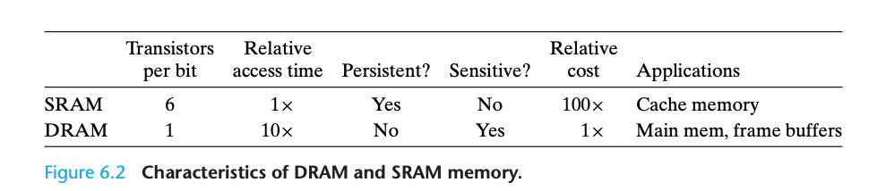
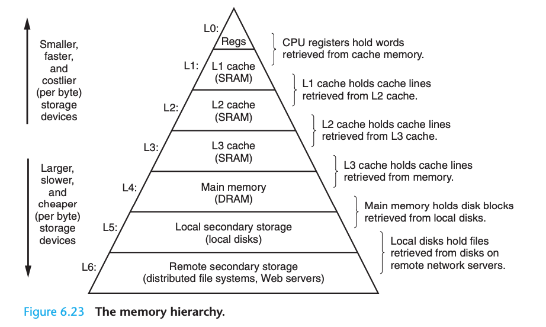
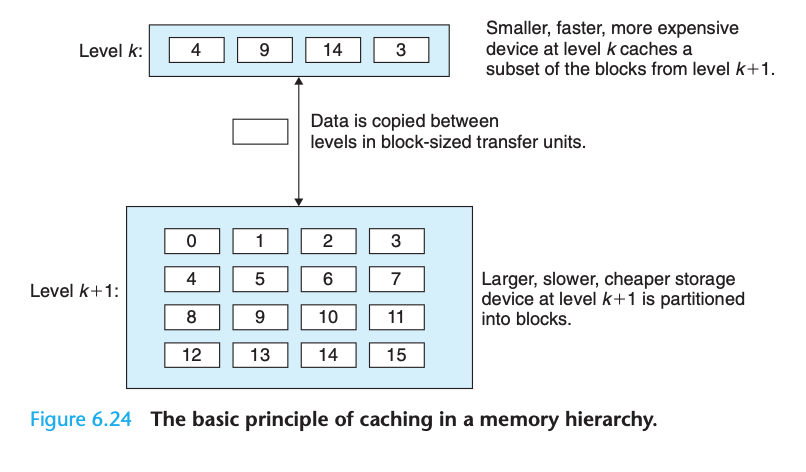
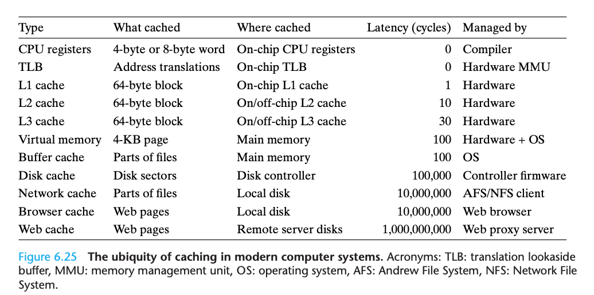
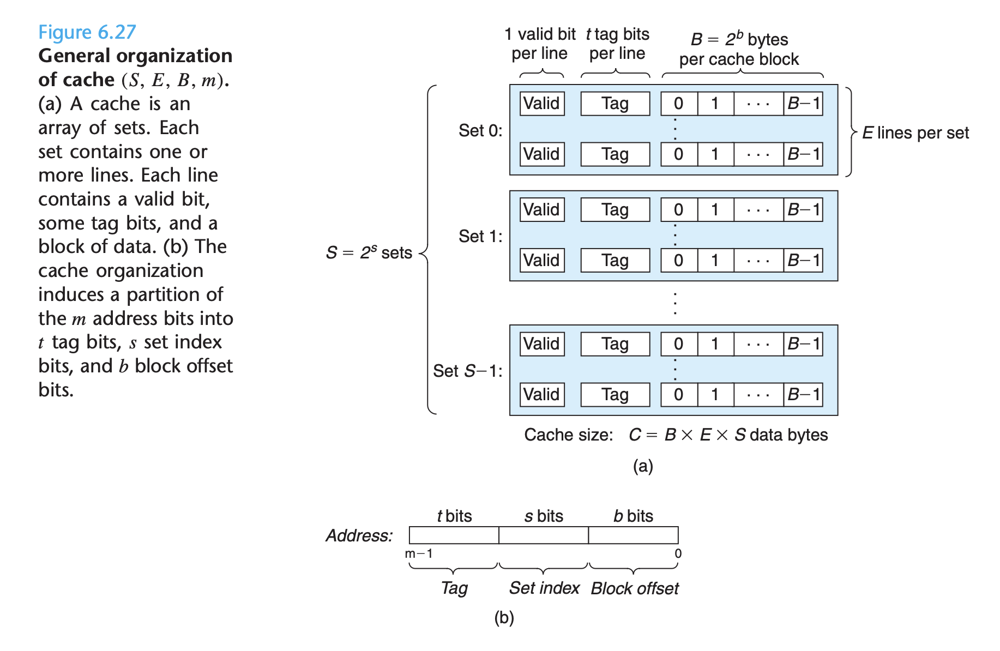
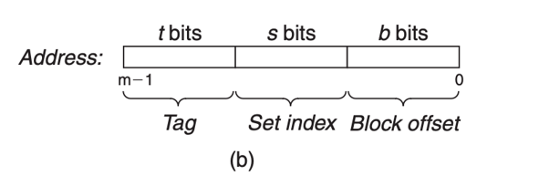
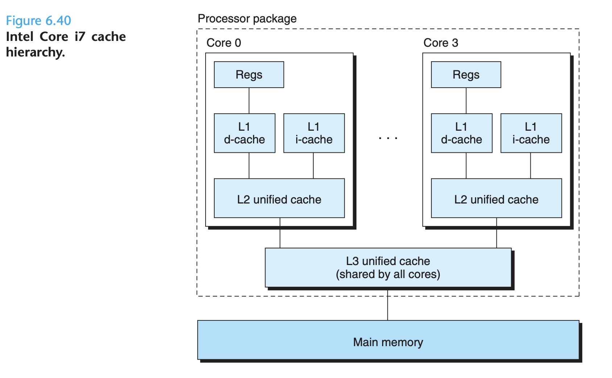
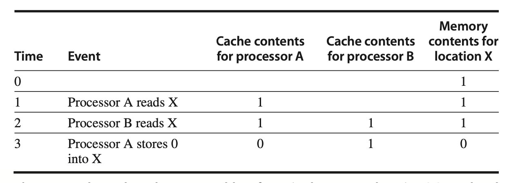
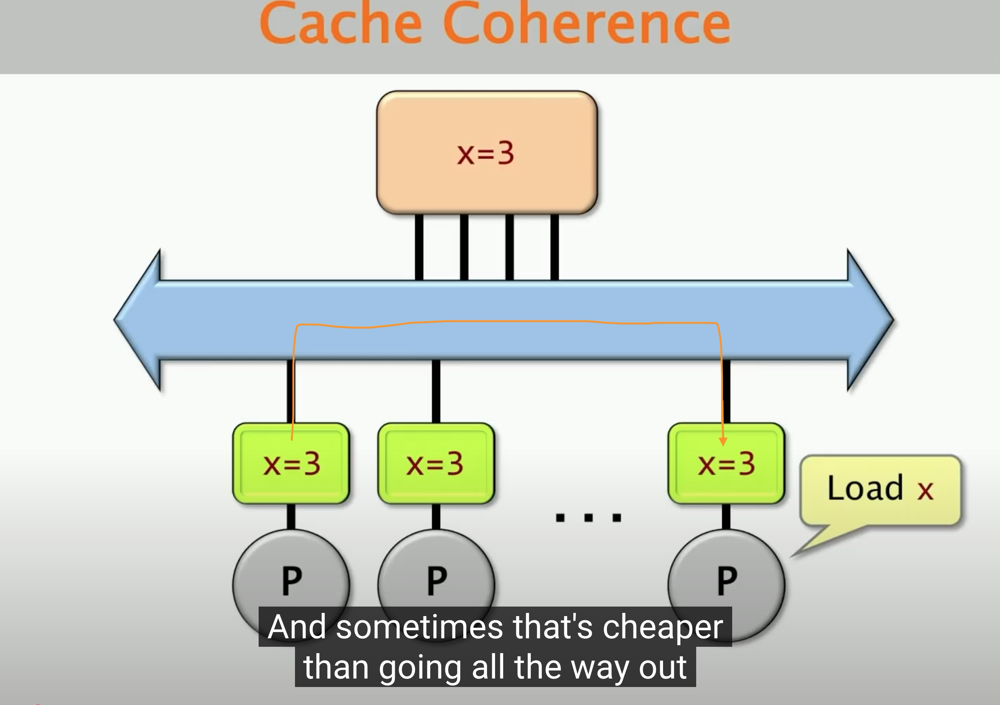

### 深入理解计算机系统

### （computer architecture，a programmer‘s perspective ）

#### 随机访问存储器（random- access memory ，RAM）

- SRAM：静态RAM，比DRAM快，用来作为高速缓存存储器
- DRAM: 动态RAM，用来作为主存

#### 局部性

编写良好的计算机程序倾向于展示出良好的局部性（locality），包括时间局部性和空间局部性

- 时间局部性：被引⽤过⼀次的存储器位置很可能在不 远的将来再被多次引⽤

- 空间局部性：如果⼀个存储器位置被引⽤了⼀次 ，那么程序很可能在不远 的将来引⽤附近的⼀个存储器位置

#### 存储器层次结构（memory hierachy）

**数据总是以块大小为传送单元**（transfer unit）

L1和L0之间通常使用one word（4Byte on 32bit，8Byte on 64bit）作为一个transfer unit

L2和L1之间以及L3和L2之间通常使用4～8 word 作为一个transfer unit

L4和L3之间通常使用几百或几千Bytes 作为一个transfer unit

**Cache miss 种类**

- cold miss：also called compulsoy miss（强制性不命中），第k层的缓存是空的，通常是短暂的
- conflict miss：硬件缓存通常由严格的放置策略，按照取模运算，k+1层的i 号block映射到k层的 （i mod 4）号缓存块，所以按照上图，k+1的 0，4，8，12 映射到k层的0号缓存块，如果k层0号请求k+1层的0号，那么k层0号就被k+1层的0号替换，然后k层0号又请求k+1层的4号，接着k+1的4号替换k的0号。如果k的0号再一次请求k+1的0号，就会发现k层没有k+1层的0号，如果这个步骤一直重复，那么就会k层的0就会一直被替换，然后每次都要从k+1层重新查找，这种称作 conflict miss
- capcaity miss：某个阶段程序经常访问的数据集在某一层cache装不下，所以就得从下一层cache 查找

**常见的缓存类型**：

**cache 的结构：**

**如何从缓存中根据地址找到想要的数据：**

要找到给定内存地址在缓存中的位置，系统会将这个地址解析成标签（Tag）、组索引（Index）和块内偏移（Offset）。以下是详细步骤，假设我们使用一个简单的4KB缓存来说明这一过程。

示例配置

假设有以下缓存配置：

	•	Cache Size: 4KB (4096字节)
	•	Block Size: 64字节（即每个缓存块能存储64字节数据）
	•	Associativity: 4路组相联缓存

根据这些参数，可以计算出：

1.	缓存组数（Set 数）：

$$
\text{Set Count} = \frac{\text{Cache Size}}{\text{Associativity} \times \text{Block Size}} = \frac{4096}{4 \times 64} = 16
$$

缓存中有16个组。
	2.	组索引位数：
组数为16，因此需要4位组索引（二进制表示16个组范围0-15）。
	3.	块内偏移位数：
块大小为64字节，因此偏移量需要6位（2^6 = 64）来确定块内的具体字节位置。
	4.	标签位数：
假设我们在32位地址空间中（即内存地址是32位），那么标签位数为：

$$
\text{Tag Bits} = 32 - (\text{Index Bits} + \text{Offset Bits}) = 32 - (4 + 6) = 22
$$

所以地址被划分成以下部分：
	•	Tag: 22位
	•	Index: 4位
	•	Offset: 6位

示例查找过程

假设有一个32位的内存地址 0x12345678，要找到这个地址在缓存中的位置。

1.	将地址转化为二进制：

$$
0x12345678 = 0001\ 0010\ 0011\ 0100\ 0101\ 0110\ 0111\ 1000_2
$$

2.	分解地址：

根据上面的位数划分，我们将地址分成Tag、Index、和Offset：
	•	Tag（前22位）：0001001000110100010101
	•	Index（中间4位）：0110
	•	Offset（最后6位）：011110
	3.	定位缓存组：
	•	Index部分是0110，它表示第6组。
	•	在4路组相联缓存中，第6组有4个缓存块可以存储数据。
	4.	查找Tag匹配的缓存块：
	•	在第6组中，检查4个缓存块的标签，寻找与Tag (0001001000110100010101) 匹配的缓存块。
	•	如果找到匹配的块，说明数据在缓存中命中；如果没有匹配，则发生缓存失效（miss）。
	5.	读取数据：
	•	如果Tag匹配成功，使用Offset (011110) 来定位块内具体的字节。
	•	Offset表示在64字节块内的第30个字节（011110对应十进制30），从而可以精确访问所需的字节数据。

总结过程

	1.	将地址分解为Tag、Index、和Offset。
	2.	使用Index找到缓存中的对应组。
	3.	检查组内各缓存块的Tag是否匹配。
	4.	如果匹配，使用Offset提取所需数据；否则发生缓存失效，需要从主存中加载数据。

这个过程帮助缓存快速定位数据，从而加速数据访问。

补充：

**解释Tag的生成过程**

​	1.	**内存申请与地址分配**：

​	•	当程序中申请一个变量的内存时（比如使用 malloc 或声明一个变量），操作系统为这个变量分配一个内存地址，这个地址在整个程序生命周期中通常保持不变。

​	•	该内存地址是一个在虚拟地址空间中的唯一值，用于定位内存位置，并没有直接涉及缓存。

​	2.	**Tag生成是在内存访问过程中发生的**：

​	•	当CPU访问该内存地址时，缓存系统会基于这个地址划分出Tag、Index和Offset。

​	•	**Tag**是从地址的高位截取的，用于在缓存中唯一标识该地址对应的内容所在的缓存块。

​	•	每次访问内存时，缓存控制器都从内存地址中动态生成这个Tag，以便在缓存中进行匹配查找。

​	3.	**Tag并不保存在主存中**：

​	•	Tag只是缓存的一部分，仅在缓存系统中用于定位。

​	•	当内存数据被加载到缓存中时，Tag被存储在缓存的“标签阵列”中，用来确认特定缓存块的数据来源内存地址。

​	•	一旦缓存数据被替换，Tag也会被更新，与内存中分配的地址或变量本身没有直接关联。

**举例说明**

假设有一个变量 int x; 在程序中声明，编译器或操作系统分配的虚拟内存地址是 0x12345678。当CPU访问x的值时：

​	1.	CPU根据地址0x12345678，从地址的高位生成Tag。

​	2.	例如，假设生成的Tag是 0001001000110100010101。

​	3.	缓存控制器用这个Tag去查找是否有对应的数据块在缓存中。

**关键点在于**：**Tag是在内存访问时生成的，与内存分配无关**。每次访问不同地址时，缓存系统根据地址生成不同的Tag，用于判断该地址是否在缓存中。

**Tag的位数越多，映射的cache block 越多：**

举例对于一个高速缓存组只有一个cache line的时候，每个cache line里只有一个cache block，那它加载cache block的时候怎么实现映射多个cache block呢，就是靠tag的值决定的，比如某个cache line，如果tag是2位的，可以表示4个值，那么cache line加载cache block的时候就可以根据tag的值选择4个候选的cache block。

这也是一个缓存大小可能只有几十Byte的L-N cache却能访问到比自己大的多的内存里的数据的原理，通过地址里的tag找到下一层的cache 里的cache block

#### 不同缓存结构的对比：

直接映射缓存、组相联缓存和全相联缓存在设计上各具特点，它们的应用场景因**性能要求**、**缓存大小**、**硬件复杂度**和**成本限制**的不同而有所区别。以下是每种缓存结构的特点和适用场景：

#### 1. **直接映射缓存（Direct-Mapped Cache）**

**特点**：
- 每个内存块只能映射到一个固定的缓存组位置（根据地址中的索引确定）。
- 实现简单，查找速度快，因为只需要在一个确定的位置查找。
- 容易发生**冲突失效**（Conflict Miss），即如果多个内存块映射到相同的缓存位置，它们会互相替换，导致频繁的失效。

**适用场景**：
- **嵌入式系统**：在嵌入式系统中，硬件资源有限，要求低功耗和低复杂度，直接映射缓存因为结构简单、成本低，适合应用在嵌入式芯片和小型设备中。
- **简单的数据访问模式**：如果应用的访问模式比较简单（例如连续访问或较少重复数据），直接映射缓存可以提供不错的性能。
- **高性能要求的场景**：直接映射缓存的查找速度较快，适合在一些对性能有高要求且缓存命中率不是很关键的场景下使用，如流水线指令缓存等。

**典型应用**：
- 低成本嵌入式系统中的数据缓存。
- CPU中的一级指令缓存（L1 Instruction Cache），因为通常指令流具有顺序执行的特点，冲突较少。

#### 2. **组相联缓存（Set-Associative Cache）**

**特点**：

- 将缓存分为多个组，每组包含多个块（称为多路），每个内存块可以映射到某个特定的组内的任一块。
- 相比直接映射缓存，减少了冲突失效的可能性，因为在一个组内可以灵活选择不同的块来存储数据。
- 查找复杂度比直接映射稍高，但仍然比全相联缓存简单。

**适用场景**：
- **通用计算场景**：组相联缓存可以更好地处理常见的应用程序中的复杂数据访问模式，适合大多数通用计算设备（如桌面电脑和服务器）。
- **对性能和复杂度有较高要求的系统**：组相联缓存在性能和实现复杂度上有较好的平衡。它既能提供高于直接映射缓存的命中率，又不至于像全相联缓存那样复杂，非常适合主流CPU的二级缓存（L2 Cache）。
- **多线程、多进程场景**：组相联缓存能够较好地处理多线程和多进程情况下的复杂数据访问模式，减少线程间的冲突失效。

**典型应用**：
- 大多数现代处理器的**二级缓存（L2）**和**三级缓存（L3）**通常都是组相联的，以适应复杂的访问模式并提高缓存命中率。
- 服务器和工作站，尤其是需要处理大量数据和复杂访问模式的计算系统。

#### 3. **全相联缓存（Fully Associative Cache）**

**特点**：
- 每个内存块可以被放入缓存中的任意一个块，没有固定的组限制。
- 缓存管理较为复杂，因为需要查找所有缓存块来决定是否命中，通常需要额外的硬件支持（如内容寻址存储器，CAM）。
- 具有最高的缓存命中率，因为可以灵活选择任何一个块来存储数据，从而极大减少冲突失效。

**适用场景**：
- **小容量缓存**：由于全相联缓存的查找复杂度较高，因此通常用于容量较小的缓存，这样可以控制查找延迟和硬件复杂度。
- **频繁访问的关键数据**：全相联缓存适合存储那些会频繁访问且不能被轻易替换的数据，例如系统中最热的数据或者关键指令流。
- **最后一级缓存或特殊用途缓存**：全相联缓存适用于那些特定用途的缓存，如CPU中的翻译后援缓冲区（Translation Lookaside Buffer，TLB），用于快速查找虚拟地址到物理地址的映射。
  

**典型应用**：
- **TLB（翻译后援缓冲区）**：TLB通常是一个小容量的全相联缓存，因为它存储的是虚拟地址和物理地址的映射表，具有很高的命中率要求。
- **小型、关键指令缓存**：全相联缓存适合存放一些关键的指令和数据，在某些高性能计算中用于存放关键数据以保证最小的访问延迟。

#### 总结对比

| 缓存类型     | 特点                         | 优势                       | 缺点                   | 适用场景                      |
| ------------ | ---------------------------- | -------------------------- | ---------------------- | ----------------------------- |
| 直接映射缓存 | 每个内存块映射到唯一位置     | 实现简单，查找速度快       | 冲突失效较多           | 嵌入式系统，简单数据访问模式  |
| 组相联缓存   | 每组多个块，同组内可灵活选择 | 减少冲突，平衡性能与复杂度 | 查找复杂度较高         | 通用计算，主流CPU的L2、L3缓存 |
| 全相联缓存   | 无固定映射，任意块存储数据   | 最少冲突失效，高命中率     | 实现复杂，查找延迟较高 | 小容量缓存，TLB，关键数据缓存 |

不同的缓存结构通过在**查找速度**、**硬件复杂度**和**缓存命中率**之间的权衡，适配了各类不同场景的需求。

**典型的CPU缓存结构**

只保存指令的叫 i-cache， 只保存数据的叫 d-cache， 两者都保存的叫unified-cache

**Performance Impact of Cache Parameters**

高速缓存参数的性能影响：

**miss rate:**

The fraction of memory references during the execution of a program, or a part of a program, that miss. 

**hit rate:**

The fraction of memory references that hit

**hit time:**

The time to deliver a word in the cache to the CPU, including the time for set selection, line identification, and word selection, Hit time is on the order of several clock cycles for L1 caches.

**miss penalty:**

The penalty for L1 misses served from L2 is on the order of 10 cycles; from L3, 40 cycles; and

from main memory, 100 cycles.

**块大小cache block size对于cache性能的影响：**

对于同样的cache 大小，较大的块可以利用空间局部性，提高命中率，比如循环遍历一个大数组，数组里很多元素一下子都被加载进cache line里了。但是块太大，反之会导致cache line数量变少，会影响时间局部性，可以这样理解：我一个包有100个口袋，另一个包有10个口袋，两个包的总容量相同，但是同一个口袋只可以装同类的东西（类比程序中每次cache line中加载的额外的数据大概率是和被访问数据相关度很高的数据），所以100个口袋的包可以每个口袋里都装100不同种类的数据，但是10个口袋的包就只能装10中不同种类的数据。

举个例子：一个for 循环里访问 a[i], b[i], c[i], d[i], e[i], f[i], 这里每个数组的大小都超过cache block，那么第一次循环时，每个cache line就都各自储存了其中一个数组的若干个元素，比如有6个cache line，那么这6个cache line分别存了a[]的一部分元素, b[]的一部分元素... 不同的cache line存着不同种类的数据。由于cache line多，所以每个数组的相邻数据都在cache 中。这种时间局部性要求高的程序就很受益，但是如果cache block size太大，导致cache line数量减少，比如就剩2个了，那么即使for 循环的时候因为cache block size大，第一个cache line可以一次性可以加载很多a[]的元素，第二个cache line可以一次性可以加载很多b[]的元素，但是这也没啥用，因为a[i]，b[i]访问完了还得访问c[i], d[i], e[i], f[i]呢。这时候cache里这俩cache line根本没有除了a[],b[]的其他数据，所以还得做cache line replacement，把a[],b[] 相关的数据替换成其他数组的元素。同理下一个for循环周期的时候又得这样来几次cache line replacement，造成cache 的conflict miss

**为什么增加缓存相联度减少冲突不命中conflict miss：**

我们的内存地址很长，能够表达的地址个数远远超出于缓存能存的数据个数，所以从顶层cache 到下一层cache就得靠地址映射，上一层的cache line 对应着下一层好多好多个cache line，这就造成下一层很多个地址对应的cache line映射到某一个上一层的cache line。具体一点，上一层的cache line A映射着下一层的0，1，2，3,当我load 下一层的cache line 0到上一层的cache line A后，如果又要load cache line 1，那么就得把cache line A的内容替换掉，就造成了conflict miss，如果缓存相联度多的话，甚至一组里就可以有四个cache line，这个组可以装下它映射的4个下一层的cache line，连续访问这4个cache line所包含的地址的话也不需要 做cache line replacement

**根据地址逐级查找cache的时候，set index的bits 长度是变化的：**

每级缓存使用不同数量的bits作为index，因为容量不同

Tag的长度随着缓存级别增加而减少

##### 写回（write back）策略和直写(write through)策略：

写回(Write-back)策略的工作原理： 当CPU要写入数据时，先将数据写入缓存(Cache)。此时主存(Main Memory)中的数据并不会立即更新,而是将该缓存块标记为"脏"(dirty)状态,表明缓存里的数据和主存不一致。只有在以下时机,脏块中的数据才会被写回主存：

1. 当该缓存块需要被替换时 例如:新的数据需要装入缓存,但缓存已满需要淘汰某个块。如果被淘汰的块是脏的,就必须先将其写回主存。
2. 当执行显式的同步指令时 比如执行内存屏障(memory barrier)指令要求确保数据一致性。
3. 当缓存控制器检测到空闲周期时 一些高级的缓存控制器会利用CPU和内存总线空闲的时机,主动将脏块写回。

相比之下,直写(Write-through)策略则简单得多： 每次CPU写操作都会同时更新缓存和主存。也就是说,缓存和主存中的数据始终保持一致,不存在脏块的概念。

##### cache block的valid bit作用：

在缓存（cache）系统中，每个缓存块（cache block）都有一个与之关联的状态位，称为有效位（valid bit）。这个有效位的主要作用是用来标识该缓存块是否包含有效的、可以使用的数据。具体来说：

- **当有效位为1时**：表示该缓存块中的数据是有效的，即它包含了来自主存（或更高层级的缓存）的真实数据，这些数据可以被处理器读取或写入。
- **当有效位为0时**：表示该缓存块目前无效，意味着它要么从未被使用过，要么曾经存储的数据已经不再有效（例如，因为对应的数据已经在主存中被更新了），此时缓存块中的内容不应该被信任或使用。

有效位对于缓存的一致性和正确性非常重要，它确保了只有当缓存中的数据确实反映了主存状态时，才会使用这些数据。这有助于避免使用陈旧或不正确的数据，从而保证系统的正常运作。

此外，有效位也用于处理缓存缺失（cache miss）的情况。当处理器尝试访问某个地址的数据而发生缓存缺失时，如果对应的缓存块的有效位为0，那么系统知道需要从主存加载最新的数据到这个缓存块，并将有效位置为1。如果有效位已经是1，但仍然发生了缺失（可能是由于标签不匹配等其他原因），则说明该缓存块虽然有效，但并不包含请求的数据，因此也需要从主存加载数据。

## 多处理器缓存一致性

为什么要多核心，因为晶体管数量增加的速度减慢了

数据有时从一个核传输到另一个核有时更高效：

### 缓存一致性protocol（MSI protocol）：

**Modified**：the block has been updated in the private cache, implies that the block is exclusive

当前缓存拥有该缓存块的唯一副本，并且此副本已经被修改。这意味着该缓存块的数据与主内存中的数据不一致, 当前缓存块将共享的副本修改会导致其他缓存的此副本变成invalid 状态

**Shared**: the block in the private cache is potentially shared

该缓存块的副本可能存在于多个缓存中，所有这些副本都是最新的

**Invalid:** the block in the private cache don't have the valid copy

该缓存块无效，表示当前缓存中不存在该缓存块的有效副本。当需要访问一个处于Invalid状态的缓存块时，缓存必须从主内存或其他缓存中重新加载该缓存块的数据。

 

####  缓存一致性的基本实现方案:

一致性缓存（Coherent Cache）为那些被同时读取的共享数据提供了复制功能，在本地缓存中制作了数据项的一个副本。这个复制功能即缩短了访问延迟又减少了对被读共享数据项的竞争。所以支持迁移与复制功能对于共享数据的访问性能非常重要，多处理器采用了一种硬件解决方案，通过引入协议来保持缓存的一致性。

