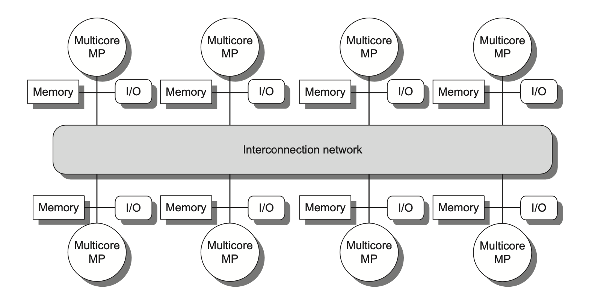

### 深入理解计算机系统

### （computer architecture，a programmer‘s perspective ）

#### 随机访问存储器（random- access memory ，RAM）

- SRAM：静态RAM，比DRAM快，用来作为高速缓存存储器
- DRAM: 动态RAM，用来作为主存


#### 局部性

编写良好的计算机程序倾向于展示出良好的局部性（locality），包括时间局部性和空间局部性

- 时间局部性：被引⽤过⼀次的存储器位置很可能在不 远的将来再被多次引⽤

- 空间局部性：如果⼀个存储器位置被引⽤了⼀次 ，那么程序很可能在不远 的将来引⽤附近的⼀个存储器位置


#### 存储器层次结构（memory hierachy）


**数据总是以块大小为传送单元**（transfer unit）

L1和L0之间通常使用one word（4Byte on 32bit，8Byte on 64bit）作为一个transfer unit

L2和L1之间以及L3和L2之间通常使用4～8 word 作为一个transfer unit

L4和L3之间通常使用几百或几千Bytes 作为一个transfer unit


##### 内存对齐：

理论上，32位系统下，int占4byte，char占一个byte，那么将它们放到一个结构体中应该占4+1=5byte；但是实际上，通过运行程序得到的结果是8 byte，这就是内存对齐所导致的。

为什么需要内存对齐？

尽管内存是以字节为单位，但是大部分处理器并不是按字节块来存取内存的.它一般会以双字节,四字节,8字节,16字节甚至32字节为单位来存取内存，我们将上述这些存取单位称为内存存取粒度，现在考虑4字节存取粒度的处理器取int类型变量（32位系统），该处理器只能从地址为4的倍数的内存开始读取数据。

假如没有[内存对齐机制](https://zhida.zhihu.com/search?content_id=4191241&content_type=Article&match_order=1&q=内存对齐机制&zhida_source=entity)，数据可以任意存放，现在一个int变量存放在从地址1开始的联系四个字节地址中，该处理器去取数据时，要先从0地址开始读取第一个4字节块,剔除不想要的字节（0地址）,然后从[地址4](https://zhida.zhihu.com/search?content_id=4191241&content_type=Article&match_order=1&q=地址4&zhida_source=entity)开始读取下一个4字节块,同样剔除不要的数据（5，6，7地址）,最后留下的两块数据合并放入[寄存器](https://zhida.zhihu.com/search?content_id=4191241&content_type=Article&match_order=1&q=寄存器&zhida_source=entity).这需要做很多工作.

##### 内存对齐规则

1. **基本类型**的对齐值就是其sizeof值;
2. **数据成员对齐规则**：结构(struct)(或联合(union))的数据成员，第一个数据成员放在offset为0的地方，以后每个数据成员的对齐按照#pragma pack指定的数值和这个数据成员自身长度中，比较小的那个进行;
3. **结构(或联合)的整体对齐规则**：在数据成员完成各自对齐之后，结构(或联合)本身也要进行对齐，对齐将按照#pragma pack指定的数值和结构(或联合)最[大数据](https://cloud.tencent.com/product/bigdata-class?from_column=20065&from=20065)成员长度中，比较小的那个进行;


**Cache miss 种类**

- cold miss：also called compulsoy miss（强制性不命中），第k层的缓存是空的，通常是短暂的
- conflict miss：硬件缓存通常由严格的放置策略，按照取模运算，k+1层的i 号block映射到k层的 （i mod 4）号缓存块，所以按照上图，k+1的 0，4，8，12 映射到k层的0号缓存块，如果k层0号请求k+1层的0号，那么k层0号就被k+1层的0号替换，然后k层0号又请求k+1层的4号，接着k+1的4号替换k的0号。如果k的0号再一次请求k+1的0号，就会发现k层没有k+1层的0号，如果这个步骤一直重复，那么就会k层的0就会一直被替换，然后每次都要从k+1层重新查找，这种称作 conflict miss
- capcaity miss：某个阶段程序经常访问的数据集在某一层cache装不下，所以就得从下一层cache 查找

**常见的缓存类型**：


**cache 的结构：**


**如何从缓存中根据地址找到想要的数据：**

要找到给定内存地址在缓存中的位置，系统会将这个地址解析成标签（Tag）、组索引（Index）和块内偏移（Offset）。以下是详细步骤，假设我们使用一个简单的4KB缓存来说明这一过程。

示例配置

假设有以下缓存配置：

	•	Cache Size: 4KB (4096字节)
	•	Block Size: 64字节（即每个缓存块能存储64字节数据）
	•	Associativity: 4路组相联缓存

根据这些参数，可以计算出：

1.	缓存组数（Set 数）：

$$
\text{Set Count} = \frac{\text{Cache Size}}{\text{Associativity} \times \text{Block Size}} = \frac{4096}{4 \times 64} = 16
$$

缓存中有16个组。
	2.	组索引位数：
组数为16，因此需要4位组索引（二进制表示16个组范围0-15）。
	3.	块内偏移位数：
块大小为64字节，因此偏移量需要6位（2^6 = 64）来确定块内的具体字节位置。
	4.	标签位数：
假设我们在32位地址空间中（即内存地址是32位），那么标签位数为：

$$
\text{Tag Bits} = 32 - (\text{Index Bits} + \text{Offset Bits}) = 32 - (4 + 6) = 22
$$

所以地址被划分成以下部分：
	•	Tag: 22位
	•	Index: 4位
	•	Offset: 6位


示例查找过程

假设有一个32位的内存地址 0x12345678，要找到这个地址在缓存中的位置。

1.	将地址转化为二进制：

$$
0x12345678 = 0001\ 0010\ 0011\ 0100\ 0101\ 0110\ 0111\ 1000
$$

2.	分解地址：

根据上面的位数划分，我们将地址分成Tag、Index、和Offset：
	•	Tag（前22位）：0001 0010 0011 0100 0101 01
	•	Index（中间4位）：1001
	•	Offset（最后6位）：111000

	3.	定位缓存组：
	•	Index部分是1001，它表示第9组。
	•	在4路组相联缓存中，第9组有4个缓存块可以存储数据。
	4.	查找Tag匹配的缓存块：
	•	在第9组中，检查4个缓存块的标签，寻找与Tag (0001001000110100010101) 匹配的缓存块。
	•	如果找到匹配的块，说明数据在缓存中命中；如果没有匹配，则发生缓存失效（miss）。
	5.	读取数据：
	•	如果Tag匹配成功，使用Offset (111000) 来定位块内具体的字节。
	•	Offset表示在64字节块内的第56个字节（111000对应十进制56），从而可以精确访问所需的字节数据。

总结过程

	1.	将地址分解为Tag、Index、和Offset。
	2.	使用Index找到缓存中的对应组。
	3.	检查组内各缓存块的Tag是否匹配。
	4.	如果匹配，使用Offset提取所需数据；否则发生缓存失效，需要从主存中加载数据。

这个过程帮助缓存快速定位数据，从而加速数据访问。


补充：

**解释Tag的生成过程**


​	1.	**内存申请与地址分配**：

​	•	当程序中申请一个变量的内存时（比如使用 malloc 或声明一个变量），操作系统为这个变量分配一个内存地址，这个地址在整个程序生命周期中通常保持不变。

​	•	该内存地址是一个在虚拟地址空间中的唯一值，用于定位内存位置，并没有直接涉及缓存。

​	2.	**Tag生成是在内存访问过程中发生的**：

​	•	当CPU访问该内存地址时，缓存系统会基于这个地址划分出Tag、Index和Offset。

​	•	**Tag**是从地址的高位截取的，用于在缓存中唯一标识该地址对应的内容所在的缓存块。

​	•	每次访问内存时，缓存控制器都从内存地址中动态生成这个Tag，以便在缓存中进行匹配查找。

​	3.	**Tag并不保存在主存中**：

​	•	Tag只是缓存的一部分，仅在缓存系统中用于定位。

​	•	当内存数据被加载到缓存中时，Tag被存储在缓存的“标签阵列”中，用来确认特定缓存块的数据来源内存地址。

​	•	一旦缓存数据被替换，Tag也会被更新，与内存中分配的地址或变量本身没有直接关联。


**举例说明**


假设有一个变量 int x; 在程序中声明，编译器或操作系统分配的虚拟内存地址是 0x12345678。当CPU访问x的值时：


​	1.	CPU根据地址0x12345678，从地址的高位生成Tag。

​	2.	例如，假设生成的Tag是 0001001000110100010101。

​	3.	缓存控制器用这个Tag去查找是否有对应的数据块在缓存中。


**关键点在于**：**Tag是在内存访问时生成的，与内存分配无关**。每次访问不同地址时，缓存系统根据地址生成不同的Tag，用于判断该地址是否在缓存中。


**Tag的位数越多，映射的cache block 越多：**

举例对于一个高速缓存组只有一个cache line的时候，每个cache line里只有一个cache block，那它加载cache block的时候怎么实现映射多个cache block呢，就是靠tag的值决定的，比如某个cache line，如果tag是2位的，可以表示4个值，那么cache line加载cache block的时候就可以根据tag的值选择4个候选的cache block。

这也是一个缓存大小可能只有几十Byte的L-N cache却能访问到比自己大的多的内存里的数据的原理，通过地址里的tag找到下一层的cache 里的cache block


#### 不同缓存结构的对比：

直接映射缓存、组相联缓存和全相联缓存在设计上各具特点，它们的应用场景因**性能要求**、**缓存大小**、**硬件复杂度**和**成本限制**的不同而有所区别。以下是每种缓存结构的特点和适用场景：

#### 1. **直接映射缓存（Direct-Mapped Cache）**

**特点**：
- 每个内存块只能映射到一个固定的缓存组位置（根据地址中的索引确定）。
- 实现简单，查找速度快，因为只需要在一个确定的位置查找。
- 容易发生**冲突失效**（Conflict Miss），即如果多个内存块映射到相同的缓存位置，它们会互相替换，导致频繁的失效。

**适用场景**：
- **嵌入式系统**：在嵌入式系统中，硬件资源有限，要求低功耗和低复杂度，直接映射缓存因为结构简单、成本低，适合应用在嵌入式芯片和小型设备中。
- **简单的数据访问模式**：如果应用的访问模式比较简单（例如连续访问或较少重复数据），直接映射缓存可以提供不错的性能。
- **高性能要求的场景**：直接映射缓存的查找速度较快，适合在一些对性能有高要求且缓存命中率不是很关键的场景下使用，如流水线指令缓存等。

**典型应用**：
- 低成本嵌入式系统中的数据缓存。
- CPU中的一级指令缓存（L1 Instruction Cache），因为通常指令流具有顺序执行的特点，冲突较少。

#### 2. **组相联缓存（Set-Associative Cache）**

**特点**：

- 将缓存分为多个组，每组包含多个块（称为多路），每个内存块可以映射到某个特定的组内的任一块。
- 相比直接映射缓存，减少了冲突失效的可能性，因为在一个组内可以灵活选择不同的块来存储数据。
- 查找复杂度比直接映射稍高，但仍然比全相联缓存简单。

**适用场景**：
- **通用计算场景**：组相联缓存可以更好地处理常见的应用程序中的复杂数据访问模式，适合大多数通用计算设备（如桌面电脑和服务器）。
- **对性能和复杂度有较高要求的系统**：组相联缓存在性能和实现复杂度上有较好的平衡。它既能提供高于直接映射缓存的命中率，又不至于像全相联缓存那样复杂，非常适合主流CPU的二级缓存（L2 Cache）。
- **多线程、多进程场景**：组相联缓存能够较好地处理多线程和多进程情况下的复杂数据访问模式，减少线程间的冲突失效。

**典型应用**：
- 大多数现代处理器的**二级缓存（L2）**和**三级缓存（L3）**通常都是组相联的，以适应复杂的访问模式并提高缓存命中率。
- 服务器和工作站，尤其是需要处理大量数据和复杂访问模式的计算系统。

#### 3. **全相联缓存（Fully Associative Cache）**

**特点**：
- 每个内存块可以被放入缓存中的任意一个块，没有固定的组限制。
- 缓存管理较为复杂，因为需要查找所有缓存块来决定是否命中，通常需要额外的硬件支持（如内容寻址存储器，CAM）。
- 具有最高的缓存命中率，因为可以灵活选择任何一个块来存储数据，从而极大减少冲突失效。

**适用场景**：
- **小容量缓存**：由于全相联缓存的查找复杂度较高，因此通常用于容量较小的缓存，这样可以控制查找延迟和硬件复杂度。
- **频繁访问的关键数据**：全相联缓存适合存储那些会频繁访问且不能被轻易替换的数据，例如系统中最热的数据或者关键指令流。
- **最后一级缓存或特殊用途缓存**：全相联缓存适用于那些特定用途的缓存，如CPU中的翻译后援缓冲区（Translation Lookaside Buffer，TLB），用于快速查找虚拟地址到物理地址的映射。
  

**典型应用**：
- **TLB（翻译后援缓冲区）**：TLB通常是一个小容量的全相联缓存，因为它存储的是虚拟地址和物理地址的映射表，具有很高的命中率要求。
- **小型、关键指令缓存**：全相联缓存适合存放一些关键的指令和数据，在某些高性能计算中用于存放关键数据以保证最小的访问延迟。

#### 总结对比

| 缓存类型     | 特点                         | 优势                       | 缺点                   | 适用场景                      |
| ------------ | ---------------------------- | -------------------------- | ---------------------- | ----------------------------- |
| 直接映射缓存 | 每个内存块映射到唯一位置     | 实现简单，查找速度快       | 冲突失效较多           | 嵌入式系统，简单数据访问模式  |
| 组相联缓存   | 每组多个块，同组内可灵活选择 | 减少冲突，平衡性能与复杂度 | 查找复杂度较高         | 通用计算，主流CPU的L2、L3缓存 |
| 全相联缓存   | 无固定映射，任意块存储数据   | 最少冲突失效，高命中率     | 实现复杂，查找延迟较高 | 小容量缓存，TLB，关键数据缓存 |

不同的缓存结构通过在**查找速度**、**硬件复杂度**和**缓存命中率**之间的权衡，适配了各类不同场景的需求。


**典型的CPU缓存结构**

只保存指令的叫 i-cache， 只保存数据的叫 d-cache， 两者都保存的叫unified-cache


**Performance Impact of Cache Parameters**

高速缓存参数的性能影响：

**miss rate:**

The fraction of memory references during the execution of a program, or a part of a program, that miss. 

**hit rate:**

The fraction of memory references that hit

**hit time:**

The time to deliver a word in the cache to the CPU, including the time for set selection, line identification, and word selection, Hit time is on the order of several clock cycles for L1 caches.

**miss penalty:**

The penalty for L1 misses served from L2 is on the order of 10 cycles; from L3, 40 cycles; and

from main memory, 100 cycles.


#### cache miss 的类型：

Cache miss 主要分为以下三种类型：

1. **Compulsory Miss** (也叫 Cold Miss)
- 当程序第一次访问某个数据时必然发生的 miss
- 因为数据之前从未被加载到 cache 中
- 即使有无限大的 cache 也无法避免这种 miss
- 可以通过预取(prefetching)技术来减少这类 miss

2. **Capacity Miss**
- 当 cache 容量不足以存储工作集(working set)时发生的 miss
- 即使采用最优的替换策略也会发生
- 发生原因是 cache 大小限制，数据块被替换出去后又被需要
- 解决方法：增加 cache 大小或优化程序的数据访问局部性

3. **Conflict Miss** (也叫 Collision Miss)
- 在组相联(set-associative)或直接映射(direct-mapped) cache 中发生
- 当多个内存位置映射到同一个 cache 行(cache line)时发生
- 即使 cache 还有空余空间，也可能因为映射限制导致数据被替换
- 解决方法：
  - 增加 cache 的组相联度
  - 优化数据布局避免冲突
  - 使用 cache 着色(cache coloring)等技术

针对这些不同类型的 cache miss，有不同的优化策略：
- 对于 Compulsory Miss：使用预取技术
- 对于 Capacity Miss：优化程序的空间和时间局部性
- 对于 Conflict Miss：调整数据对齐和内存布局

理解这些 miss 类型对于性能优化非常重要，因为不同类型的 miss 需要采用不同的优化策略。


**块大小cache block size对于cache性能的影响：**

对于同样的cache 大小，较大的块可以利用空间局部性，提高命中率，比如循环遍历一个大数组，数组里很多元素一下子都被加载进cache line里了。但是块太大，反之会导致cache line数量变少，会影响时间局部性，可以这样理解：我一个包有100个口袋，另一个包有10个口袋，两个包的总容量相同，但是同一个口袋只可以装同类的东西（类比程序中每次cache line中加载的额外的数据大概率是和被访问数据相关度很高的数据），所以100个口袋的包可以每个口袋里都装100不同种类的数据，但是10个口袋的包就只能装10中不同种类的数据。

举个例子：一个for 循环里访问 a[i], b[i], c[i], d[i], e[i], f[i], 这里每个数组的大小都超过cache block，那么第一次循环时，每个cache line就都各自储存了其中一个数组的若干个元素，比如有6个cache line，那么这6个cache line分别存了a[]的一部分元素, b[]的一部分元素... 不同的cache line存着不同种类的数据。由于cache line多，所以每个数组的相邻数据都在cache 中。这种时间局部性要求高的程序就很受益，但是如果cache block size太大，导致cache line数量减少，比如就剩2个了，那么即使for 循环的时候因为cache block size大，第一个cache line可以一次性可以加载很多a[]的元素，第二个cache line可以一次性可以加载很多b[]的元素，但是这也没啥用，因为a[i]，b[i]访问完了还得访问c[i], d[i], e[i], f[i]呢。这时候cache里这俩cache line根本没有除了a[],b[]的其他数据，所以还得做cache line replacement，把a[],b[] 相关的数据替换成其他数组的元素。同理下一个for循环周期的时候又得这样来几次cache line replacement，造成cache 的conflict miss


**为什么增加缓存相联度减少冲突不命中conflict miss：**

我们的内存地址很长，能够表达的地址个数远远超出于缓存能存的数据个数，所以从顶层cache 到下一层cache就得靠地址映射，上一层的cache line 对应着下一层好多好多个cache line，这就造成下一层很多个地址对应的cache line映射到某一个上一层的cache line。具体一点，上一层的cache line A映射着下一层的0，1，2，3,当我load 下一层的cache line 0到上一层的cache line A后，如果又要load cache line 1，那么就得把cache line A的内容替换掉，就造成了conflict miss，如果缓存相联度多的话，甚至一组里就可以有四个cache line，这个组可以装下它映射的4个下一层的cache line，连续访问这4个cache line所包含的地址的话也不需要 做cache line replacement


**根据地址逐级查找cache的时候，set index的bits 长度是变化的：**

每级缓存使用不同数量的bits作为index，因为容量不同

Tag的长度随着缓存级别增加而减少


##### 写回（write back）策略和直写(write through)策略：

写回(Write-back)策略的工作原理： 当CPU要写入数据时，先将数据写入缓存(Cache)。此时主存(Main Memory)中的数据并不会立即更新,而是将该缓存块标记为"脏"(dirty)状态,表明缓存里的数据和主存不一致。只有在以下时机,脏块中的数据才会被写回主存：

1. 当该缓存块需要被替换时 例如:新的数据需要装入缓存,但缓存已满需要淘汰某个块。如果被淘汰的块是脏的,就必须先将其写回主存。
2. 当执行显式的同步指令时 比如执行内存屏障(memory barrier)指令要求确保数据一致性。
3. 当缓存控制器检测到空闲周期时 一些高级的缓存控制器会利用CPU和内存总线空闲的时机,主动将脏块写回。

相比之下,直写(Write-through)策略则简单得多： 每次CPU写操作都会同时更新缓存和主存。也就是说,缓存和主存中的数据始终保持一致,不存在脏块的概念。


##### cache block的valid bit作用：

在缓存（cache）系统中，每个缓存块（cache block）都有一个与之关联的状态位，称为有效位（valid bit）。这个有效位的主要作用是用来标识该缓存块是否包含有效的、可以使用的数据。具体来说：

- **当有效位为1时**：表示该缓存块中的数据是有效的，即它包含了来自主存（或更高层级的缓存）的真实数据，这些数据可以被处理器读取或写入。
- **当有效位为0时**：表示该缓存块目前无效，意味着它要么从未被使用过，要么曾经存储的数据已经不再有效（例如，因为对应的数据已经在主存中被更新了），此时缓存块中的内容不应该被信任或使用。

有效位对于缓存的一致性和正确性非常重要，它确保了只有当缓存中的数据确实反映了主存状态时，才会使用这些数据。这有助于避免使用陈旧或不正确的数据，从而保证系统的正常运作。

此外，有效位也用于处理缓存缺失（cache miss）的情况。当处理器尝试访问某个地址的数据而发生缓存缺失时，如果对应的缓存块的有效位为0，那么系统知道需要从主存加载最新的数据到这个缓存块，并将有效位置为1。如果有效位已经是1，但仍然发生了缺失（可能是由于标签不匹配等其他原因），则说明该缓存块虽然有效，但并不包含请求的数据，因此也需要从主存加载数据。


## 多处理器缓存一致性


为什么要多核心，因为晶体管数量增加的速度减慢了


### shared-memory multiprocessors Architecture:

#### SMP:

symmetric (shared-memory) multiprocessors (**SMP**), or **centralized shared-memory multiprocessors**

most existing multicores are SMPs, but not all.

SMP architectures are also sometimes called uniform memory access (**UMA**) multiprocessors, arising from the fact that all processors have a uniform latency from memory, even if the memory is organized into multiple banks


#### DSM:

distributed shared memory (**DSM**) 

A DSM multiprocessor is also called a NUMA (nonuniform memory access) because the access time depends on the location of a data word in memory

With the rapid increase in processor performance and the associated increase in a processor’s memory bandwidth requirements, the number of cores shrinks among multiprocessor that decide to take the DSM architecture 

-  key disadvantages for a DSM are that communicating data among processors becomes somewhat more complex 
- a DSM requires more effort in the software to take advantage of the increased memory bandwidth provided by distributed memories




an example of amd numa cpu architecture：

every ccd（core complex die） represents a numa node


### AMD EPYC NUMA Architecture Explained

The diagram illustrates the key components of a NUMA (Non-Uniform Memory Access) architecture in an AMD EPYC server processor. Here's an explanation of the components:


### Physical Components

1. **Socket**: 
   - A physical CPU package that contains multiple CPU cores and memory controllers
   - Modern server systems typically have 2-8 sockets
   - Each AMD EPYC socket shown contains multiple NUMA nodes

2. **NUMA Node**:
   - A group of CPU cores that share the same local memory access characteristics
   - AMD EPYC processors typically have multiple NUMA nodes per socket (2 in this example)
   - Memory access within a NUMA node is faster than across NUMA nodes

3. **CPU Cores**:
   - Individual processing units that execute instructions
   - Each NUMA node contains multiple cores (8 cores per NUMA node in this example)
   - AMD EPYC processors can have up to 64+ cores per socket

4. **Memory Controller**:
   - Hardware that manages data flow between CPU cores and memory
   - Each NUMA node has its own dedicated memory controller
   - Controls access to the local memory attached to that NUMA node

5. **Memory Channels**:
   - Physical connections between memory controllers and memory modules
   - Multiple channels per controller increase memory bandwidth
   - AMD EPYC supports 8+ memory channels per socket

### Memory Access Characteristics

- **Local Memory Access**: When a core accesses memory within its own NUMA node (fast)
- **Remote Memory Access**: When a core accesses memory in another NUMA node (slower)
- **Inter-Socket Access**: Memory access across different physical sockets (slowest)

### Interconnects

- **Intra-Socket Connections**: Connect NUMA nodes within the same socket
- **Inter-Socket Connections**: Connect different physical sockets together
- AMD uses Infinity Fabric as its interconnect technology

This architecture allows AMD EPYC processors to scale to high core counts while maintaining reasonable memory access performance through local memory prioritization.


数据有时从一个核传输到另一个核有时更高效：


####  缓存一致性的基本实现方案:

一致性缓存（Coherent Cache）为那些被同时读取的共享数据提供了复制功能，在本地缓存中制作了数据项的一个副本。这个复制功能即缩短了访问延迟又减少了对被读共享数据项的竞争。所以支持迁移与复制功能对于共享数据的访问性能非常重要，多处理器采用了一种硬件解决方案，通过引入协议来保持缓存的一致性。

### 缓存一致性protocol（MSI protocol）：

**Modified**：the block has been updated in the private cache, implies that the block is exclusive

当前缓存拥有该缓存块的唯一副本，并且此副本已经被修改。这意味着该缓存块的数据与主内存中的数据不一致, 当前缓存块将共享的副本修改会导致其他缓存的此副本变成invalid 状态

**Shared**: the block in the private cache is potentially shared

该缓存块的副本可能存在于多个缓存中，所有这些副本都是最新的

**Invalid:** the block in the private cache don't have the valid copy

该缓存块无效，表示当前缓存中不存在该缓存块的有效副本。当需要访问一个处于Invalid状态的缓存块时，缓存必须从主内存或其他缓存中重新加载该缓存块的数据。


 

## MESI 协议

MESI 协议其实是 4 个状态单词的开头字母缩写，分别是：

- *Modified*，已修改
- *Exclusive*，独占
- *Shared*，共享
- *Invalidated*，已失效

流程图见下链接：小林coding

https://www.xiaolincoding.com/os/1_hardware/cpu_mesi.html#%E6%80%BB%E7%BA%BF%E5%97%85%E6%8E%A2

有一点要注意：关于modified 状态，其他核对同一个数据的读/写，都会导致local 核先write-back，先把local核的数据写入内存。其他核读，则local 核的cache line变成shared 状态；其他核写，则local 核变成invalidated 状态


#### 分布式共享存储器和目录一致性（Distributed Shared-Memory and Directory-Based Coherence）

**目录一致性协议的通俗理解：**

让我用生活中的例子来解释目录式一致性协议：

想象一个大型图书馆系统，有多个分馆（就像多个CPU核心），还有一个总馆（就像目录控制器）。每个分馆都可能有同一本书的副本（就像缓存数据）。

1. 基本工作原理：
- 总馆维护一个目录，记录着每本书在哪些分馆有副本
- 任何分馆要借书或修改书之前，都必须先向总馆询问

2. 典型场景举例：

场景一：读取数据
- 比如分馆A要借一本《红楼梦》
- 先问总馆："这本书在哪里有？"
- 总馆查目录：
  - 如果其他分馆有，就告诉A去那里借
  - 如果没有，就从主库调一本给A

场景二：修改数据
- 如果分馆B要在《红楼梦》上做笔记
- 先问总馆："我要修改这本书"
- 总馆就会：
  - 通知所有有这本书的分馆销毁他们的副本
  - 给B独占权限
  - 更新目录记录

3. 主要优点：
- 不像广播协议那样需要通知所有分馆，只通知相关的分馆
- 总馆集中管理，比分馆之间直接沟通更有序
- 节省了系统总线带宽

4. 主要缺点：
- 所有操作都要经过总馆，总馆可能成为瓶颈
- 如果总馆出问题，整个系统就瘫痪了

这就像一个有秩序的图书管理系统，通过中央控制来确保所有分馆的书本内容保持一致，避免混乱。在计算机系统中，这种机制保证了多个CPU核心看到的内存数据是一致的。

**目录协议如何节省总线带宽：**

让我解释目录式协议如何节省带宽，通过对比广播(Snooping)协议：

1. 广播协议的带宽消耗：
- 每次写操作都要广播给所有处理器
- 每个处理器都必须监听总线上的所有广播消息
- 即使某个处理器根本没有缓存相关数据，也要处理这些消息
- 随着处理器数量增加，广播消息呈指数级增长

2. 目录式协议的优化：
- 目录精确记录了哪些处理器缓存了数据
- 只向真正需要的处理器发送消息
- 例如：如果只有处理器1和处理器2缓存了数据X，那么处理器3修改X时：
  - 广播协议：会通知所有处理器
  - 目录协议：只通知处理器1和2

3. 具体场景举例：
假设系统有8个处理器，只有2个处理器缓存了某数据：
- 广播协议：1次写操作 = 7条广播消息
- 目录协议：1次写操作 = 2条定向消息
- 节省了5条不必要的消息传输

这种选择性通知的机制，使得目录式协议在大规模多处理器系统中特别有效，因为它避免了大量不必要的消息传输。

**目录一致性协议的实现：**

在每个multicore processor 的L3共享cache中，每一个cache block 都有一个bit vector去标记这个cache block被哪个core 的独占L2/L1 cache所拥有其copy，因此由于此cache block上的数据发生的invalidation 也只会通知到这些拥有其数据copy的cache


**目录一致性协议简介**


目录一致性协议（Directory-Based Cache Coherence Protocol）是一种**分布式缓存一致性协议**，通过维护一个**目录（Directory）**来跟踪系统中缓存块的状态与位置，从而确保在多核或多处理器系统中数据一致性。


**为什么需要目录一致性协议**

​	•	**广播协议的局限性（如 MSI/MESI）**：

当处理器核数量较多时，基于广播的协议（如 MESI）可能导致大量无效的广播消息，从而增加系统总线负担。

​	•	**目录协议的优势**：

​	1.	**减少消息数量**：目录协议只通知必要的节点，不需要全系统广播。

​	2.	**更高扩展性**：适合大量处理器核的系统。

**目录一致性协议的基本组成**

​	1.	**目录（Directory）**：

​	•	位于主存中，维护每个缓存块的元信息。

​	•	通常包含缓存块的物理地址和与该块相关的状态信息。

​	•	跟踪哪些处理器节点持有某个块，以及它们的状态（共享、独占或修改）。

​	2.	**缓存块的状态位（Cache Block States）**：

​	•	类似于 MESI 协议中的状态（Modified、Exclusive、Shared、Invalid）。

​	•	每个缓存块通常在目录中有与之对应的标志位和节点列表。

​	3.	**关键元信息字段**：

​	•	**Valid 位（有效性位）**：标记该缓存块是否有效。

​	•	**Dirty 位（脏位）**：标记该缓存块是否被修改。

​	•	**Sharer List（共享节点列表）**：记录哪些节点持有该缓存块。

​	•	**Owner（拥有者）**：标记该块由哪个节点独占持有。

##### **目录协议的实现细节**

##### --**目录表结构**


一个目录条目可能包含以下字段：

| **字段**      | **描述**                 |
| ------------- | ------------------------ |
| Block Address | 该缓存块在主存中的地址   |
| State         | 缓存块状态 (M, E, S, I)  |
| Sharer List   | 哪些节点共享了此缓存块   |
| Owner         | 当前块的独占修改持有节点 |

**Cache Block上的位**


为了支持目录协议，缓存块需要维护额外的位来记录状态：

​	•	**V 位（Validity bit）**：记录缓存块是否有效。

​	•	**D 位（Dirty bit）**：标记缓存块是否被修改，需要写回。

​	•	**Tag 位（块地址 Tag）**：用于与目录中的地址匹配。

​	•	**状态位（M/E/S/I）**：跟踪块的状态。


**典型操作流程**

​	1.	**读命中（Read Hit）**：

​	•	缓存直接返回数据，无需与目录交互。

​	2.	**读未命中（Read Miss）**：

​	•	处理器向目录发送请求，目录查找共享列表：

​	•	如果没有节点持有该块（状态为 Invalid），从主存加载并返回。

​	•	如果其他节点持有块但为共享状态（Shared），将数据返回给请求节点。

​	•	如果其他节点持有块且为 Modified 状态，则要求该节点写回主存，再返回数据。

​	3.	**写操作（Write Hit/Miss）**：

​	•	**写命中（Write Hit）**：

​	•	若为独占（Exclusive）或修改（Modified）状态，直接写入缓存。

​	•	若为共享（Shared）状态，则需要向目录发请求，使其他节点无效。

​	•	**写未命中（Write Miss）**：

​	•	请求独占访问权限，确保其他节点无效。

**例子：目录协议中的状态转换**


假设核心 A 对地址 X 进行写操作，核心 B 和 C 持有该块的共享副本：

​	1.	核心 A 发出写请求，目录检测到块 X 被核心 B、C 共享。

​	2.	目录向 B、C 发送无效消息，使它们将块标记为 Invalid。

​	3.	目录更新块状态为 Modified，并将核心 A 标记为拥有者。

**总结**


目录一致性协议通过利用缓存块上的状态位（如 Valid、Dirty、M/E/S/I 状态位）和主存中的目录结构来高效管理多核系统中的缓存一致性。与广播协议相比，目录协议的消息开销和扩展性更好，是大规模处理器系统的一种重要解决方案。


### Performance of Symmetric Shared-Memory Multiprocessors:(对称共享存储器多处理器的性能)

In particular, the overall cache performance is a combination of the：

- behavior of uniprocessor cache miss traffic
- the traffic caused by communication, which results in invalidations and subsequent cache misses


### Ture sharing miss and False sharing:

让我详细解释真共享缺失（True Sharing Miss）和假共享缺失（False Sharing Miss）：

真共享缺失（True Sharing Miss）：
1. 定义：
   - 多个处理器确实需要访问同一个数据
   - 当一个处理器修改数据后，其他需要该数据的处理器的缓存失效

2. 示例：
```c++
// 多个线程共享一个计数器
int counter = 0;  // 共享变量

// 线程1
counter++;  // 修改计数器

// 线程2
int value = counter;  // 读取计数器，发生真共享缺失
```

```c++
// Structure demonstrating true sharing
struct SharedCounter {
    int value;  // This single variable is shared between threads
};

void increment_counter(SharedCounter* data, int iterations) {
    for (int i = 0; i < iterations; i++) {
        // Both threads modify the exact same variable
        // This is true sharing - actual contention on the same data
        data->value++;
    }
}

int main() {
    SharedCounter data = {0};
    const int iterations = 10000000;
    // Create two threads that will modify the same variable
    std::thread t1(increment_counter, &data, iterations);
    std::thread t2(increment_counter, &data, iterations);

    t1.join();
    t2.join();
    return 0;
}
```


3. 解决方法：
   - 减少共享数据的访问频率
   - 使用适当的同步机制
   - 分解共享数据（如果可能）

假共享缺失（False Sharing Miss）：
1. 定义：
   - 多个处理器访问的是不同的数据
   - 但这些数据恰好位于同一个缓存行（cache line）中
   - 一个处理器修改数据会导致整个缓存行失效

2. 示例：
```c
struct {
    int x;  // 线程1使用
    int y;  // 线程2使用
} data;     // x和y在同一个缓存行

// 线程1
data.x++;   // 修改x，导致包含y的缓存行也失效

// 线程2
int val = data.y;  // 读取y，发生假共享缺失
```

```c++
// Structure to demonstrate true sharing
struct SharedData {
    int counter1;  // Used by thread 1
    int counter2;  // Used by thread 2
    // Both counters likely share the same cache line
};

void increment_counter1(SharedData* data, int iterations) {
    for (int i = 0; i < iterations; i++) {
        data->counter1++;
        // This modification invalidates the entire cache line
        // affecting counter2 even though it's not being modified
    }
}

void increment_counter2(SharedData* data, int iterations) {
    for (int i = 0; i < iterations; i++) {
        data->counter2++;
        // This modification also invalidates the entire cache line
        // affecting counter1 even though it's not being modified
    }
}

int main() {
    SharedData data = {0, 0};
    const int iterations = 10000000;

    // Create two threads that will modify different variables
    // but likely share the same cache line
    std::thread t1(increment_counter1, &data, iterations);
    std::thread t2(increment_counter2, &data, iterations);

    t1.join();
    t2.join();
    return 0;
}
```


3. 解决方法：
   - 填充（padding）数据结构：

```c
struct {
    int x;
    char pad1[60];  // padding makes x exclusively own a cache line
    int y;
    char pad2[60];  // padding makes y exclusively own a cache line
} data;
```
   - 数据对齐：确保频繁访问的数据在不同的缓存行

   - 使用编译器指令（如 `alignas`）

     ```c++
     struct alignas(64) AlignedStruct {  // 64 is typical cache line size
         int counter1;
         char pad[60];
         int counter2;
     };
     ```

     

主要区别：
1. 数据访问意图：
   - 真共享：处理器确实需要访问相同数据
   - 假共享：处理器访问不同数据，但受缓存行组织影响

2. 必要性：
   - 真共享：是程序逻辑所必需的
   - 假共享：是缓存组织导致的意外效果

3. 优化方向：
   - 真共享：优化数据共享的算法和同步机制
   - 假共享：优化数据在内存中的布局

4. 性能影响：
   - 两者都会导致缓存失效和性能下降
   - 假共享更容易优化，因为可以通过数据布局来避免

在实际编程中，尤其是需要高性能的多线程程序，需要同时考虑这两种共享问题，采取适当的优化措施。

**如何判断程序是否存在False sharing呢？**：

perf stat -e cache-misses ./program 查看是否cache miss增多

valgrind --tool=cachegrind ./program 判断是否存在频繁的共享变量冲突


#### Bandwidth Consideration：

- Each processor has a maximum bandwidth to the memory which is shared by all cores and hyper-threads on that processor. multiple processors might share the same bus to memory or the Northbridge（北桥（Northbridge）是计算机主板上的一个芯片，负责连接CPU与高速设备，如内存（RAM）和显卡（GPU）

- The processor cores themselves run at frequencies where, at full speed, even in perfect conditions, the connection to the memory cannot fulfill all load and store requests without waiting.  Efficient programs may be limited in their performance by the available memory bandwidth.

  ##### How to recongnize if the slowdown is caused by memory bandwidth?

  - **NUS_BNR_DRV** event counts the number of cycles a core has to wait because the bus is not ready

  - **offcore_requests_outstanding.cycles_with_data_rd**:  this event count, In practical terms, this counter helps you measure memory-related bottlenecks by showing how many cycles your core spends waiting for data to come back from memory. A high count here could indicate:

    - Memory bandwidth saturation
    - High memory latency
    - Potential memory access patterns that could be optimized

    This metric is particularly useful when profiling applications that are memory-bound rather than compute-bound.

  

  example:

  

  One situation which can cause big memory bus usage is when two threads are scheduled on different processors (or cores in different cache domains) and they use the same data set. Figure 6.13 shows such a situation. Core 1 and 3 access the same data (indicated by the same color for the access indicator and the memory area). Similarly core 2 and 4 access the same data. But the threads are scheduled on different processors. This means each data set has to be read twice from memory. This situation can be handled better

  

  In Figure 6.14 we see how it should ideally look like. Now the total cache size in use is reduced since now core 1 and 2 and core 3 and 4 work on the same data. The data sets have to be read from memory only once.


### 优化策略和最佳实践:

- #### 提升局部性：

- #### 合理选择数据结构：

  - 避免过度使用链表等不连续存储数据结构

  - 使用alignas(64) 来强制缓存行对齐， The `alignas` specifier, introduced in C11, controls the alignment of variables and user-defined types (struct, union, class). It ensures that an object is stored in memory at an address that is a multiple of a specified value。

    ```c++
    struct GoodStruct {
    	alignas(64) int b; // forcelly align to 64 byte, b must be in one cache line
    	char a;
    }
    ```

    这样使int b单独在一个缓存行中，**防止false sharing**（比如多线程访问同一个缓存行上的不同变量时，即使访问的不是同一个数据，但是cpu仍然要更新整个缓存行，导致另外一个线程要用到的变量失效，造成cache miss）

- #### 数据分块：


​	将数据分割成小块，使每块数据可以完全装入缓存，从而减少主存访问次数，例子：矩阵乘法优化：

**分块矩阵乘法示例：4x4矩阵**


​	•	**缓存友好性**: 分块使得小块数据能够完全装入缓存，减少缓存未命中。

​	•	**减少主存访问**: 每个块计算可以重用已经加载的数据，从而提高缓存命中率。

​	这种分块技术对于大规模矩阵计算尤其有效，能够显著提升性能。


- #### 避免FalseSharing:

